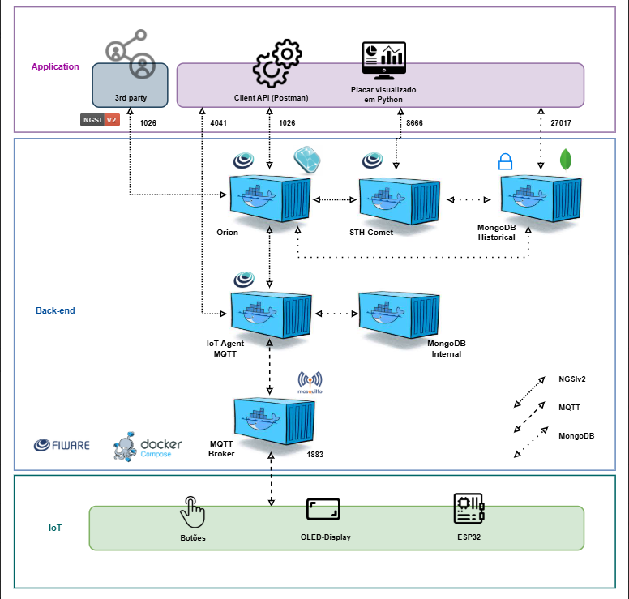
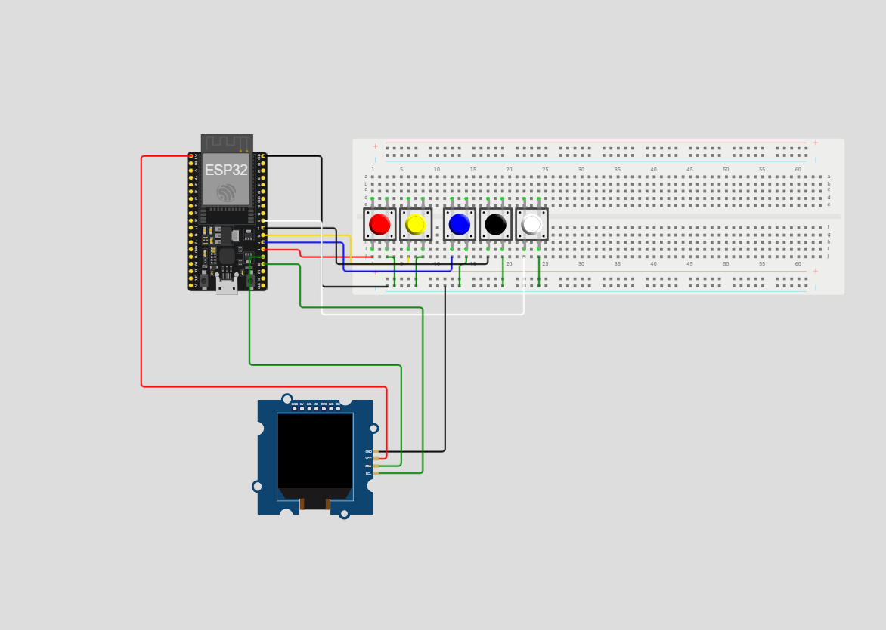

# 🏆 Gerenciador de Placar Inteligente - Copa Passa a Bola

  

  
  
  
  

---

## 👩‍💻 Integrantes

  Enzo Ramos - RM: 563705| Felipe Cerazi: 562746 | Gustavo Peaguda- RM: 562923 | Lorenzo Coque: 563385 

---

## 📖 Sobre o Projeto

O **Gerenciador de Placar Inteligente** é uma solução completa para a **Copa Passa a Bola**, campeonato amador de futebol feminino.  

Ele integra:
- **ESP32 com botões no Wokwi**  
- **Máquina virtual na Azure**  
- **Postman**  
- **Notebook Google Colab**  

🎯 **Objetivo:** atualizar o placar em tempo real e controlar gols, cartões e tempo de jogo com interação física via botões.

### ⚡ Funcionalidades dos Botões
- 🟡 Adicionar/remover **cartões amarelos**  
- 🔴 Adicionar/remover **cartões vermelhos**  
- ⚽ Adicionar/remover **gols da equipe A**  
- ⚽ Adicionar/remover **gols da equipe B**  
- ⏱️ **Pausar, continuar e reiniciar** o tempo do placar  

---

## 🏗️ Arquitetura do Sistema

  

### 🔍 Explicação

1. **ESP32 + Botões (Wokwi):** captura ações físicas dos botões (gols, cartões, tempo).  
2. **MQTT + Azure:** eventos do ESP32 são enviados para a máquina virtual na Azure, que processa e transmite dados.  
3. **Google Colab:** código Python recebe eventos e atualiza a interface HTML + CSS do placar em tempo real.  
4. **Postman:** arquivo `score atualizado.json` permite testar endpoints e integração com outros sistemas.

---

## 🛠️ Recursos Necessários

- 💻 Computador com **Google Colab**  
- ☁️ Acesso à **máquina virtual na Azure**  
- [🎮 Wokwi ESP32](https://wokwi.com/projects/442288825722106881)  
- 🧰 **Postman** com `score atualizado.json`  
- 🌐 Browser para visualizar o placar em tempo real  

---

## ⚙️ Como Usar

### 1️⃣ Simulação Wokwi
1. Abra o projeto no Wokwi: [Clique aqui](https://wokwi.com/projects/442288825722106881)  
2. Interaja com os botões virtuais para alterar gols, cartões ou pausar/continuar o tempo.  

  

### 2️⃣ Google Colab
1. Abra `Untitled2.ipynb` no Google Colab.  
2. Execute as células para conectar ao **ESP32** via MQTT/IP da Azure.  
3. O placar será atualizado em tempo real refletindo todas as ações dos botões.

### 3️⃣ Postman
1. Importe `score atualizado.json` no Postman.  
2. Teste os endpoints para simular eventos do jogo ou verificar logs de atualização do placar.

### 4️⃣ Visualização do Placar
- Mostra:
  - Gols de cada equipe ⚽  
  - Cartões amarelos 🟡 e vermelhos 🔴  
  - Estado do tempo de jogo ⏱️  

### 5️⃣ Vídeo Demonstrativo
Assista ao funcionamento completo: [YouTube 🎬](https://youtu.be/FIKXscPuLE4)

---

---

## 🚀 Contribuições

Este projeto é **educacional e colaborativo**.  
Sinta-se à vontade para:
- 📚 Estudar o código  
- ✨ Integrar melhorias  
- 🛠️ Testar novas funcionalidades  

---

> Desenvolvido com dedicação por **Enzo Ramos, Felipe Cerazi, Gustavo Peaguda e Lorenzo Coque** ⚽💻  

